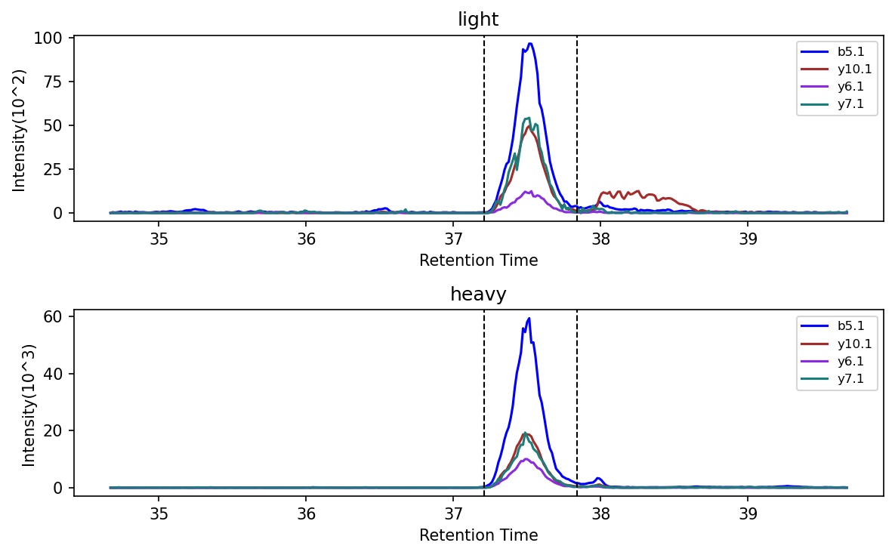
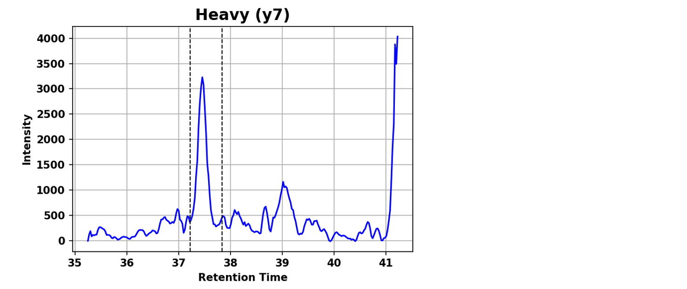
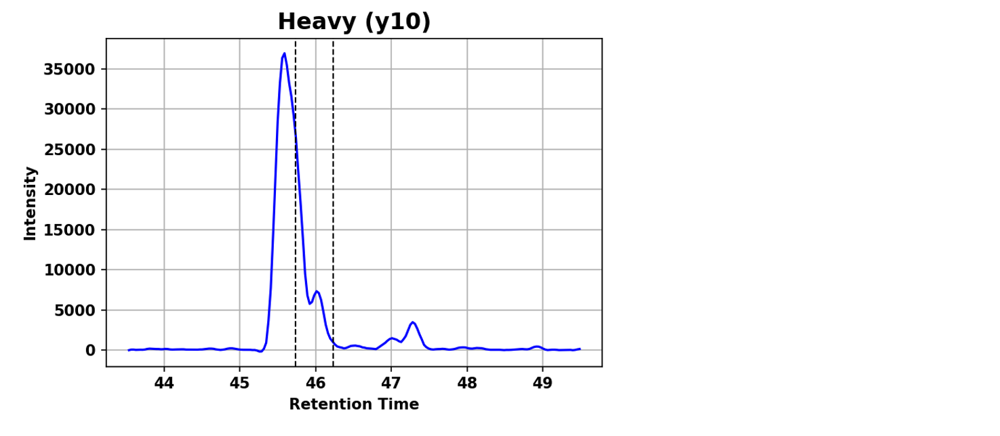
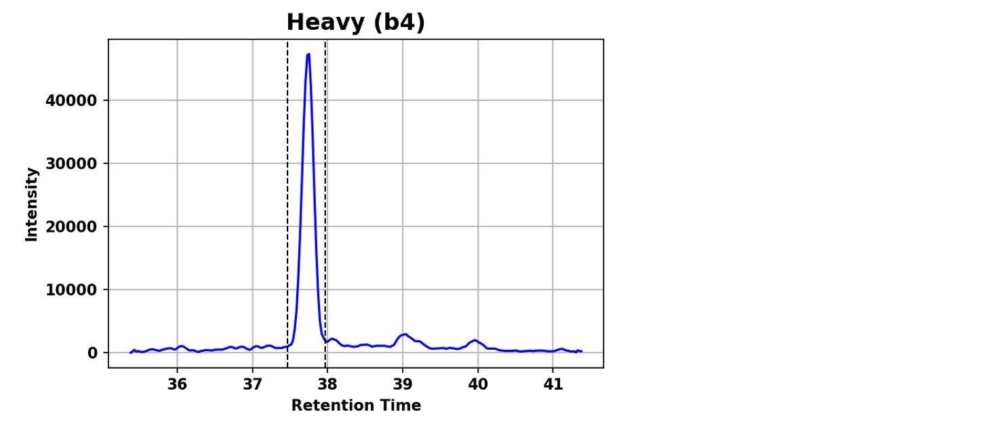
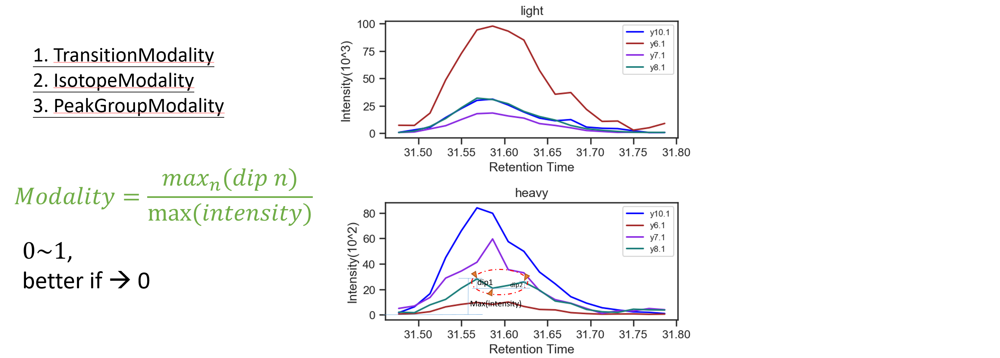
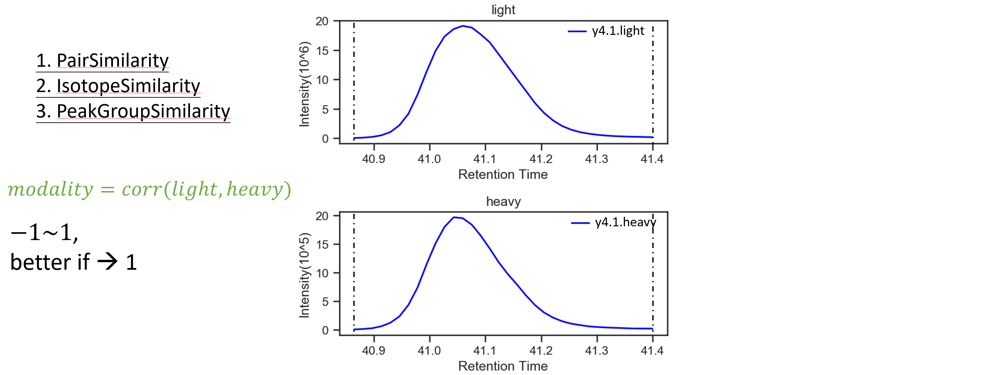
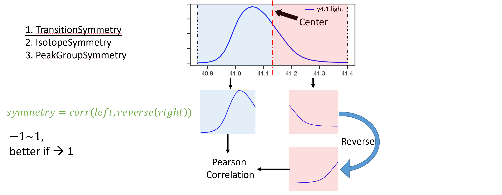
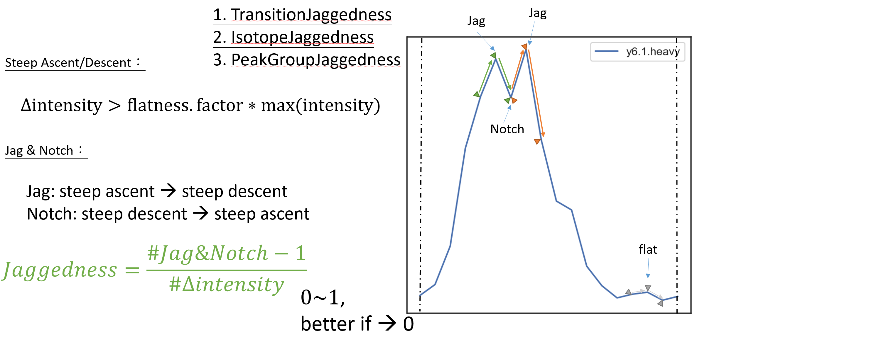
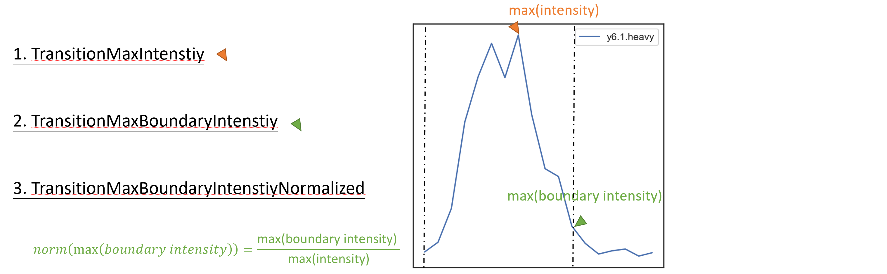
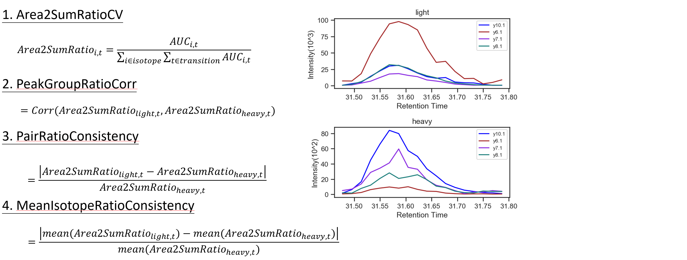

# Peak Quality Scoring Sysyem of Chromatogram

On chromatogram data of mass spectrometry (MS), a boundary will be given for calculating area that stands for quantity of protein. In experimental data, test specimens are always clear, no interfering substances, for estimating protein quantity exactly. In our clinical data, however, noise and interference will much inference the boundary setting, so that these changes in boundary will decrease the orecision of protein quantity. 

- chromatogram data

- noise

- interference

- perfect peak

Unfortunately, there is no standard method to solve these matters so far. As a result, we developed a tool, which refferred to [TargetedMSQC](https://clinicalproteomicsjournal.biomedcentral.com/articles/10.1186/s12014-018-9209-x), to help us assess the quality of bounded peak.

## Index of Peak Quality 

1. Modality

2. Similarity

3. Symmetry

4. Jaggedness

5. Intensity

6. HWFM (Full width at half maximum)

7. Area Ratio

## References

[Quality assessment and interference detection in targeted mass spectrometry data using machine learning.](https://clinicalproteomicsjournal.biomedcentral.com/articles/10.1186/s12014-018-9209-x)